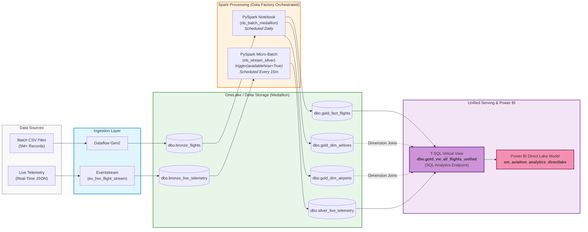

```mermaid
flowchart LR
    %% Data Sources
    subgraph SOURCES["Data Sources"]
        S1["Batch CSV Files<br/>(5M+ Records)"]
        S2["Live Telemetry<br/>(Real-Time JSON)"]
    end

    %% Ingestion Layer
    subgraph INGEST["Ingestion Layer"]
        I1["Dataflow Gen2"]
        I2["Eventstream<br/>(ev_live_flight_stream)"]
    end

    %% Medallion Storage (OneLake / Delta)
    subgraph MEDALLION["OneLake / Delta Storage (Medallion)"]
        direction TB
        B1[("dbo.bronze_flights")]
        B2[("dbo.bronze_live_telemetry")]
        
        SV1[("dbo.silver_live_telemetry")]
        
        G1[("dbo.gold_fact_flights")]
        G2[("dbo.gold_dim_airlines")]
        G3[("dbo.gold_dim_airports")]
    end

    %% Compute & Processing
    subgraph COMPUTE["Spark Processing (Data Factory Orchestrated)"]
        P1["PySpark Notebook<br/>(nb_batch_medallion)<br/><i>Scheduled Daily</i>"]
        P2["PySpark Micro-Batch<br/>(nb_stream_silver)<br/><i>trigger(availableNow=True)</i><br/><i>Scheduled Every 15m</i>"]
    end

    %% Virtualization & Reporting
    subgraph SERVING["Unified Serving & Power BI"]
        VIEW["T-SQL Virtual View<br/><b>dbo.gold_vw_all_flights_unified</b><br/>(SQL Analytics Endpoint)"]
        PBI["Power BI Direct Lake Model<br/><b>sm_aviation_analytics_directlake</b>"]
    end

    %% Batch Flow Connections
    S1 --> I1 --> B1
    B1 --> P1 --> G1
    P1 --> G2
    P1 --> G3

    %% Streaming Flow Connections
    S2 --> I2 --> B2
    B2 --> P2 --> SV1

    %% Serving Connections
    G1 --> VIEW
    SV1 --> VIEW
    G2 -. Dimension Joins .-> VIEW
    G3 -. Dimension Joins .-> VIEW
    VIEW --> PBI

    %% Node Styling
    style SOURCES fill:#f9f9f9,stroke:#666,stroke-width:1px
    style INGEST fill:#e1f5fe,stroke:#0288d1,stroke-width:2px
    style MEDALLION fill:#e8f5e9,stroke:#388e3c,stroke-width:2px
    style COMPUTE fill:#fff3e0,stroke:#f57c00,stroke-width:2px
    style SERVING fill:#f3e5f5,stroke:#7b1fa2,stroke-width:2px
    style VIEW fill:#ce93d8,stroke:#4a148c,stroke-width:2px
    style PBI fill:#f48fb1,stroke:#880e4f,stroke-width:2px
```
